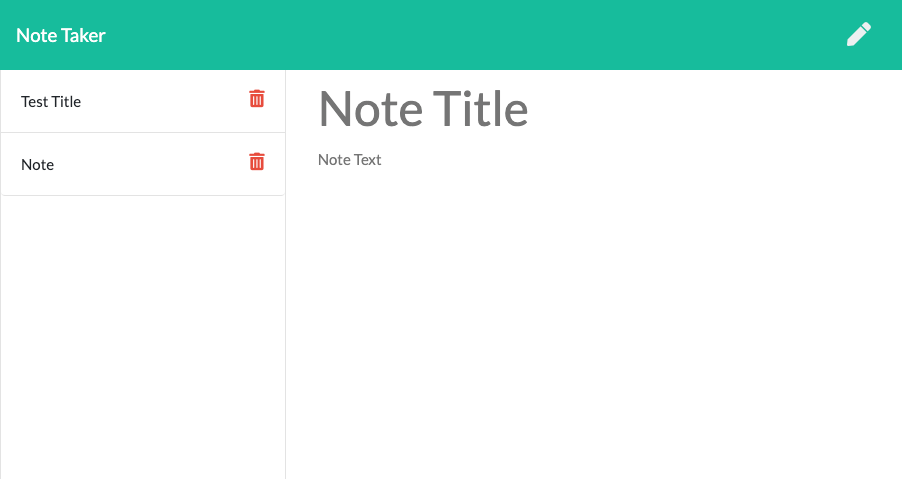

# Note-Taker-App

## Purpose

This Repository is being used to develop and display a note taking and saving app.
Note-Taker allows the user to save note into a data base for persisting data storage as well as retrieve and delete the notes.  

Link to Github Repository
https://github.com/Marquez-Brown

## Usage

- List Install a code editor such as Sublime text, Atomic text editor, or Visual Studio.
- Download the Github repository at https://github.com/Marquez-Brown/note-taker-app
- Edit the files as you see fit in the code editor of your choice.  
- Download and install Node, NPM, Express

## If you would like to contribute

To help with refactoring the code, please ask for a clone of the repo, make the changes along with comments and for overview and permission to push.

[]

MIT License

Copyright <2020> <Marquez Brown>

Permission is hereby granted, free of charge, to any person obtaining a copy of this software and associated documentation files (the "Software"), to deal in the Software without restriction, including without limitation the rights to use, copy, modify, merge, publish, distribute, sublicense, and/or sell copies of the Software, and to permit persons to whom the Software is furnished to do so, subject to the following conditions:

The above copyright notice and this permission notice shall be included in all copies or substantial portions of the Software.

THE SOFTWARE IS PROVIDED "AS IS", WITHOUT WARRANTY OF ANY KIND, EXPRESS OR IMPLIED, INCLUDING BUT NOT LIMITED TO THE WARRANTIES OF MERCHANTABILITY, FITNESS FOR A PARTICULAR PURPOSE AND NONINFRINGEMENT. IN NO EVENT SHALL THE AUTHORS OR COPYRIGHT HOLDERS BE LIABLE FOR ANY CLAIM, DAMAGES OR OTHER LIABILITY, WHETHER IN AN ACTION OF CONTRACT, TORT OR OTHERWISE, ARISING FROM, OUT OF OR IN CONNECTION WITH THE SOFTWARE OR THE USE OR OTHER DEALINGS IN THE SOFTWARE.

